# BigDataCases
### ***Кейс 1***: Анализ успеваемости студентов
Набор данных: [скачать набор данных](cases/case1/Успеваемость студентов.csv)  

В кейсе анализируется успеваемость студентов из файла `Успеваемость студентов.csv`. Строятся три типа графиков:
- **Scatter plot**: Диаграмма рассеяния оценок по семестрам.
- **Bar plot**: Столбчатая диаграмма средних оценок по группам.
- **Box plot**: Коробчатая диаграмма распределения оценок по дисциплинам.

Графики:  
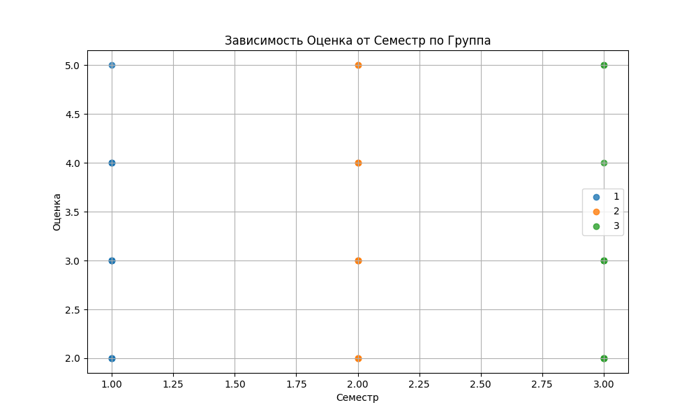
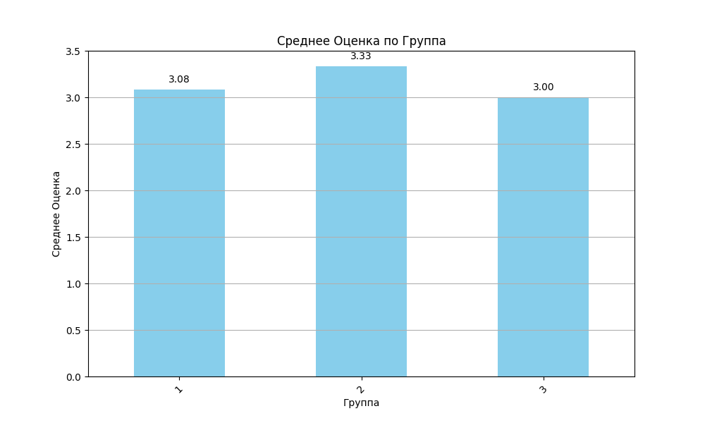
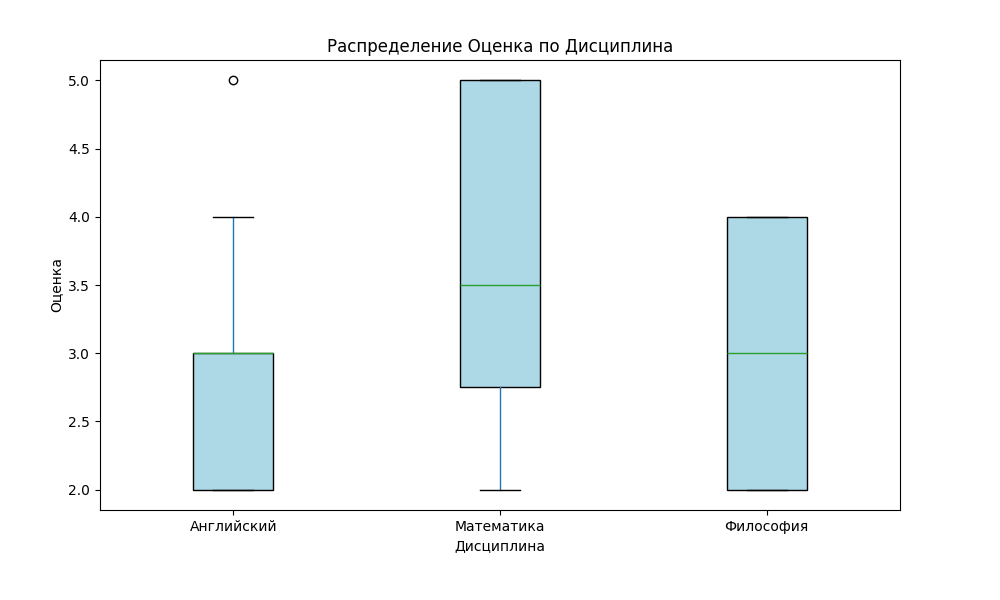

Исходный код:  
```python
import pandas as pd
import matplotlib.pyplot as plt

def scatter_plot(df, show_plots=False):
    fig, ax = plt.subplots(figsize=(10, 6))
    groups = df['Группа'].unique()
    colors = plt.cm.tab10.colors[:len(groups)]

    for i, group in enumerate(groups):
        subset = df[df['Группа'] == group]
        ax.scatter(
            subset['Семестр'],
            subset['Оценка'],
            label=group,
            color=colors[i],
            alpha=0.8
        )

    ax.set_title('Зависимость Оценка от Семестр по Группа')
    ax.set_xlabel('Семестр')
    ax.set_ylabel('Оценка')
    ax.legend()
    ax.grid(True)
    fig.savefig('scatter_plot.png')
    if show_plots:
        plt.show()
    plt.close(fig)

def bar_plot(df, show_plots=False):
    fig, ax = plt.subplots(figsize=(10, 6))
    avg_score_by_group = df.groupby('Группа')['Оценка'].mean()
    avg_score_by_group.plot(kind='bar', ax=ax, color='skyblue')

    for p in ax.patches:
        ax.annotate(f'{p.get_height():.2f}', (p.get_x() + p.get_width() / 2., p.get_height()),
                    ha='center', va='center', xytext=(0, 10), textcoords='offset points')

    ax.set_title('Среднее Оценка по Группа')
    ax.set_xlabel('Группа')
    ax.set_ylabel('Среднее Оценка')
    ax.tick_params(axis='x', rotation=45)
    ax.grid(axis='y')
    fig.savefig('bar_plot.png')
    if show_plots:
        plt.show()
    plt.close(fig)

def box_plot(df, show_plots=False):
    fig, ax = plt.subplots(figsize=(10, 6))
    df.boxplot(column='Оценка', by='Дисциплина', ax=ax, grid=False, patch_artist=True, boxprops=dict(facecolor='lightblue'))
    ax.set_title('Распределение Оценка по Дисциплина')
    fig.suptitle('')
    ax.set_xlabel('Дисциплина')
    ax.set_ylabel('Оценка')
    fig.savefig('box_plot.png')
    if show_plots:
        plt.show()
    plt.close(fig)

def main(show_plots = False):
    file_path = "Успеваемость студентов.csv"

    try:
        df = pd.read_csv(
            file_path,
            usecols=["ФИО", "Группа", "Дисциплина", "Оценка", "Семестр"]
        )
    except ValueError as e:
        raise ValueError(f"Ошибка при чтении CSV: {e}. Проверьте названия столбцов.")

    df["Группа"] = pd.to_numeric(df["Группа"], errors='coerce')
    df["Оценка"] = pd.to_numeric(df["Оценка"], errors='coerce')
    df["Семестр"] = pd.to_numeric(df["Семестр"], errors='coerce')
    df = df.dropna()

    print(f"Форма данных: {df.shape}")

    scatter_plot(df, show_plots)
    bar_plot(df, show_plots)
    box_plot(df, show_plots)

if __name__ == "__main__":
    main(show_plots = True)
```
### ***Кейс 2***: Обработка результатов анкетирования
Набор данных: [скачать набор данных](cases/case2/Результаты анкетирования.csv)  

В кейсе анализируется результаты актетирования из файла `Результаты анкетирования.csv`. Строятся три типа графиков:
- **Scatter plot**: Диаграмма рассеяния ответов на первый вопрос.
- **Bar plot**: Столбчатая диаграмма среднего результата при ответе на первый вопрос.
- **Box plot**: Коробчатая диаграмма распределения ответов на первый вопрос.

Графики:  


Исходный код:  
```python
import pandas as pd
import matplotlib.pyplot as plt

def scatter_plot(df, show_plots=False):
    fig, ax = plt.subplots(figsize=(10, 6))
    groups = df['Группа'].unique()
    colors = plt.cm.tab10.colors[:len(groups)]

    for i, group in enumerate(groups):
        subset = df[df['Группа'] == group]
        ax.scatter(
            subset['Группа'],
            subset['Вопрос 1'],
            label=group,
            color=colors[i],
            alpha=0.8
        )

    ax.set_title('Зависимость Вопрос 1 от Группа')
    ax.set_xlabel('Группа')
    ax.set_ylabel('Вопрос 1')
    ax.legend()
    ax.grid(True)
    fig.savefig('scatter_plot.png')
    if show_plots:
        plt.show()
    plt.close(fig)

def bar_plot(df, show_plots=False):
    fig, ax = plt.subplots(figsize=(10, 6))
    avg_q1_by_group = df.groupby('Группа')['Вопрос 1'].mean()
    avg_q1_by_group.plot(kind='bar', ax=ax, color='skyblue')

    for p in ax.patches:
        ax.annotate(f'{p.get_height():.2f}', (p.get_x() + p.get_width() / 2., p.get_height()),
                    ha='center', va='center', xytext=(0, 10), textcoords='offset points')

    ax.set_title('Среднее Вопрос 1 по Группа')
    ax.set_xlabel('Группа')
    ax.set_ylabel('Среднее Вопрос 1')
    ax.tick_params(axis='x', rotation=45)
    ax.grid(axis='y')
    fig.savefig('bar_plot.png')
    if show_plots:
        plt.show()
    plt.close(fig)

def box_plot(df, show_plots=False):
    fig, ax = plt.subplots(figsize=(10, 6))
    df.boxplot(column='Вопрос 1', by='Группа', ax=ax, grid=False, patch_artist=True, boxprops=dict(facecolor='lightblue'))
    ax.set_title('Распределение Вопрос 1 по Группа')
    fig.suptitle('')
    ax.set_xlabel('Группа')
    ax.set_ylabel('Вопрос 1')
    fig.savefig('box_plot.png')
    if show_plots:
        plt.show()
    plt.close(fig)

def main(show_plots = False):
    file_path = "Результаты анкетирования.csv"

    try:
        df = pd.read_csv(
            file_path,
            usecols=["ФИО", "Группа", "Вопрос 1", "Вопрос 2", "Вопрос 3"]
        )
    except ValueError as e:
        raise ValueError(f"Ошибка при чтении CSV: {e}. Проверьте названия столбцов.")

    df["Группа"] = pd.to_numeric(df["Группа"], errors='coerce')
    df["Вопрос 1"] = pd.to_numeric(df["Вопрос 1"], errors='coerce')
    df["Вопрос 2"] = pd.to_numeric(df["Вопрос 2"], errors='coerce')
    df["Вопрос 3"] = pd.to_numeric(df["Вопрос 3"], errors='coerce')
    df = df.dropna()

    print(f"Форма данных: {df.shape}")

    scatter_plot(df, show_plots)
    bar_plot(df, show_plots)
    box_plot(df, show_plots)

if __name__ == "__main__":
    main(show_plots = True)
```

### ***Кейс 3***: Анализ посещаемости занятий
Набор данных: [скачать набор данных](cases/case3/Посещяемость занятий.csv)  

В кейсе анализируется посещаемость студентов из файла `Посещаемость занятий.csv`. Строятся три типа графиков:
- **Scatter plot**: Диаграмма рассеяния посещаемости по группам.
- **Bar plot**: Столбчатая диаграмма средней посещаемоти по группам.
- **Box plot**: Коробчатая диаграмма распределения посещаемости по граппам.

Графики:  


Исходный код:  
```python
import pandas as pd
import matplotlib.pyplot as plt

def scatter_plot(df, show_plots=False):
    fig, ax = plt.subplots(figsize=(10, 6))
    groups = df['Группа'].unique()
    colors = plt.cm.tab10.colors[:len(groups)]

    for i, group in enumerate(groups):
        subset = df[df['Группа'] == group]
        ax.scatter(
            subset['Группа'],
            subset['Присутствие'],
            label=group,
            color=colors[i],
            alpha=0.8
        )

    ax.set_title('Зависимость Присутствие от Группа')
    ax.set_xlabel('Группа')
    ax.set_ylabel('Присутствие (0 - Нет, 1 - Да)')
    ax.legend()
    ax.grid(True)
    fig.savefig('scatter_plot.png')
    if show_plots:
        plt.show()
    plt.close(fig)

def bar_plot(df, show_plots=False):
    fig, ax = plt.subplots(figsize=(10, 6))
    avg_attendance_by_group = df.groupby('Группа')['Присутствие'].mean()
    avg_attendance_by_group.plot(kind='bar', ax=ax, color='skyblue')

    for p in ax.patches:
        ax.annotate(f'{p.get_height():.2f}', (p.get_x() + p.get_width() / 2., p.get_height()),
                    ha='center', va='center', xytext=(0, 10), textcoords='offset points')

    ax.set_title('Среднее Присутствие по Группа')
    ax.set_xlabel('Группа')
    ax.set_ylabel('Среднее Присутствие')
    ax.tick_params(axis='x', rotation=45)
    ax.grid(axis='y')
    fig.savefig('bar_plot.png')
    if show_plots:
        plt.show()
    plt.close(fig)

def box_plot(df, show_plots=False):
    fig, ax = plt.subplots(figsize=(10, 6))
    df.boxplot(column='Присутствие', by='Группа', ax=ax, grid=False, patch_artist=True, boxprops=dict(facecolor='lightblue'))
    ax.set_title('Распределение Присутствие по Группа')
    fig.suptitle('')  # Убираем автоматический заголовок от pandas
    ax.set_xlabel('Группа')
    ax.set_ylabel('Присутствие (0 - Нет, 1 - Да)')
    fig.savefig('box_plot.png')
    if show_plots:
        plt.show()
    plt.close(fig)

def main(show_plots = False):
    file_path = "Посещаемость занятий.csv"

    try:
        df = pd.read_csv(
            file_path,
            usecols=["Дата", "Группа", "ФИО", "Присутствие"]
        )
    except ValueError as e:
        raise ValueError(f"Ошибка при чтении CSV: {e}. Проверьте названия столбцов.")

    df["Группа"] = pd.to_numeric(df["Группа"], errors='coerce')
    df["Присутствие"] = df["Присутствие"].map({"Да": 1, "Нет": 0})
    df = df.dropna()

    print(f"Форма данных: {df.shape}")

    scatter_plot(df, show_plots)
    bar_plot(df, show_plots)
    box_plot(df, show_plots)

if __name__ == "__main__":
    main(show_plots = True)
```

### ***Кейс 4***: Обработка результатов тестирования
Набор данных: [скачать набор данных](cases/case4/Результаты тесирования.csv)  

В кейсе анализируются результаты тестирования студентов из файла `Результаты тесирования.csv`. Строятся три типа графиков:
- **Scatter plot**: Диаграмма рассеяния правильных ответов по студентам.
- **Bar plot**: Столбчатая диаграмма среднего результата правильных ответов по студентам.
- **Box plot**: Коробчатая диаграмма распределения результата правильных ответов по студентам.

Графики:  
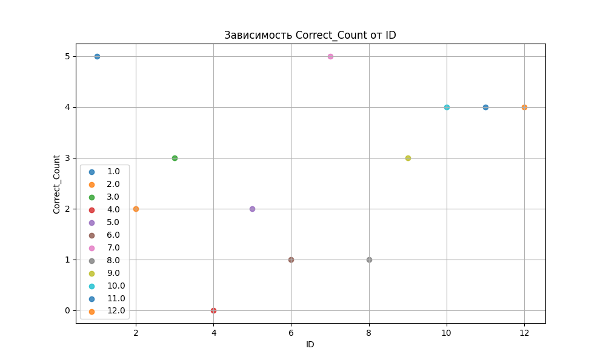
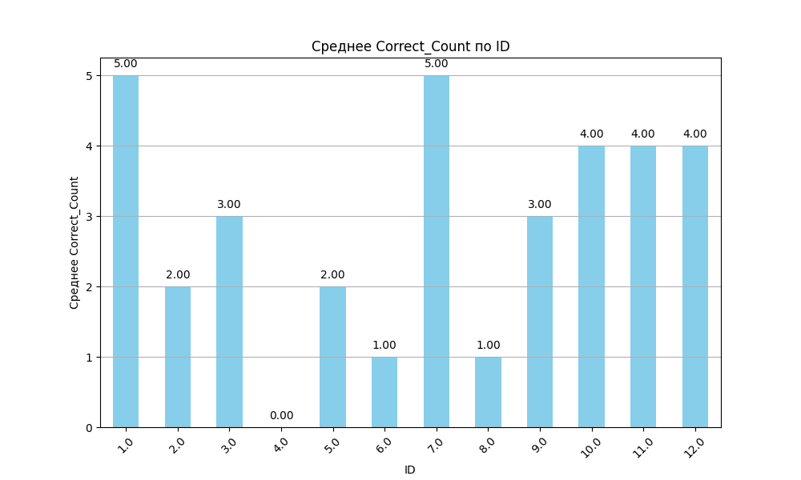
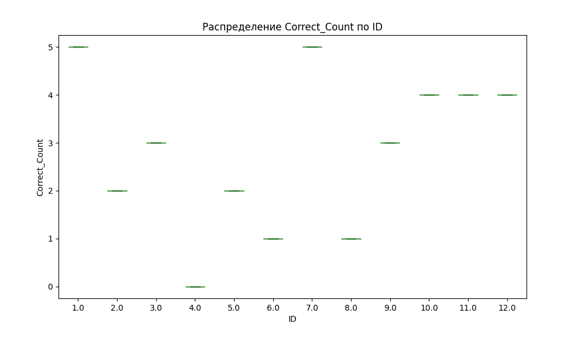

Исходный код:  
```python
import pandas as pd
import matplotlib.pyplot as plt

def scatter_plot(df, show_plots=False):
    fig, ax = plt.subplots(figsize=(10, 6))
    ids = df['ID'].unique()

    for i, id_val in enumerate(ids):
        subset = df[df['ID'] == id_val]
        ax.scatter(
            subset['ID'],
            subset['Correct_Count'],
            label=id_val,
            alpha=0.8
        )

    ax.set_title('Зависимость Correct_Count от ID')
    ax.set_xlabel('ID')
    ax.set_ylabel('Correct_Count')
    ax.legend()
    ax.grid(True)
    fig.savefig('scatter_plot.png')
    if show_plots:
        plt.show()
    plt.close(fig)

def bar_plot(df, show_plots=False):
    fig, ax = plt.subplots(figsize=(10, 6))
    avg_correct_by_id = df.groupby('ID')['Correct_Count'].mean()
    avg_correct_by_id.plot(kind='bar', ax=ax, color='skyblue')

    for p in ax.patches:
        ax.annotate(f'{p.get_height():.2f}', (p.get_x() + p.get_width() / 2., p.get_height()),
                    ha='center', va='center', xytext=(0, 10), textcoords='offset points')

    ax.set_title('Среднее Correct_Count по ID')
    ax.set_xlabel('ID')
    ax.set_ylabel('Среднее Correct_Count')
    ax.tick_params(axis='x', rotation=45)
    ax.grid(axis='y')
    fig.savefig('bar_plot.png')
    if show_plots:
        plt.show()
    plt.close(fig)

def box_plot(df, show_plots=False):
    fig, ax = plt.subplots(figsize=(10, 6))
    df.boxplot(column='Correct_Count', by='ID', ax=ax, grid=False, patch_artist=True, boxprops=dict(facecolor='lightblue'))
    ax.set_title('Распределение Correct_Count по ID')
    fig.suptitle('')  # Убираем автоматический заголовок от pandas
    ax.set_xlabel('ID')
    ax.set_ylabel('Correct_Count')
    fig.savefig('box_plot.png')
    if show_plots:
        plt.show()
    plt.close(fig)

def main(show_plots = False):
    file_path = "Результаты тесирования.csv"

    try:
        df = pd.read_csv(
            file_path,
            usecols=["ФИО", "ID", "1", "2", "3", "4", "5", "6", "7", "8", "9", "10"]
        )
    except ValueError as e:
        raise ValueError(f"Ошибка при чтении CSV: {e}. Проверьте названия столбцов.")

    # Получаем правильные ответы из последней строки
    correct_answers = df.iloc[-1, 2:]  # Столбцы с 1 по 10
    df = df.iloc[:-1]  # Убираем последнюю строку с правильными ответами

    # Преобразуем ответы в числа
    df.iloc[:, 2:] = df.iloc[:, 2:].apply(pd.to_numeric, errors='coerce')

    # Считаем количество правильных ответов
    df["Correct_Count"] = (df.iloc[:, 2:] == correct_answers.values).sum(axis=1)

    df["ID"] = pd.to_numeric(df["ID"], errors='coerce')
    df = df.dropna()

    print(f"Форма данных: {df.shape}")

    scatter_plot(df, show_plots)
    bar_plot(df, show_plots)
    box_plot(df, show_plots)

if __name__ == "__main__":
    main(show_plots = True)
```

### ***Кейс 5***: Анализ научной активности
Набор данных: [скачать набор данных](cases/case5/Научная активность.csv)  

В кейсе анализируется научная активность студентов из файла `Научная активность.csv`. Строятся три типа графиков:
- **Scatter plot**: Диаграмма рассеяния количества и типов публикаций по годам.
- **Bar plot**: Столбчатая диаграмма среднего года по типам публикаций.
- **Box plot**: Коробчатая диаграмма распределения годов по типам публикаций.

Графики:  


Исходный код:  
```python
import pandas as pd
import matplotlib.pyplot as plt

def scatter_plot(df, show_plots=False):
    fig, ax = plt.subplots(figsize=(10, 6))
    types = df['Тип'].unique()
    colors = plt.cm.tab10.colors[:len(types)]

    for i, typ in enumerate(types):
        subset = df[df['Тип'] == typ]
        ax.scatter(
            subset['Год'],
            subset['Publication_Count'],
            label=typ,
            color=colors[i],
            alpha=0.8
        )

    ax.set_title('Зависимость Publication_Count от Год по Тип')
    ax.set_xlabel('Год')
    ax.set_ylabel('Publication_Count')
    ax.legend()
    ax.grid(True)
    fig.savefig('scatter_plot.png')
    if show_plots:
        plt.show()
    plt.close(fig)

def bar_plot(df, show_plots=False):
    fig, ax = plt.subplots(figsize=(10, 6))
    avg_year_by_type = df.groupby('Тип')['Год'].mean()
    avg_year_by_type.plot(kind='bar', ax=ax, color='skyblue')

    for p in ax.patches:
        ax.annotate(f'{p.get_height():.2f}', (p.get_x() + p.get_width() / 2., p.get_height()),
                    ha='center', va='center', xytext=(0, 10), textcoords='offset points')

    ax.set_title('Среднее Год по Тип')
    ax.set_xlabel('Тип')
    ax.set_ylabel('Среднее Год')
    ax.tick_params(axis='x', rotation=45)
    ax.grid(axis='y')
    fig.savefig('bar_plot.png')
    if show_plots:
        plt.show()
    plt.close(fig)

def box_plot(df, show_plots=False):
    fig, ax = plt.subplots(figsize=(10, 6))
    df.boxplot(column='Год', by='Тип', ax=ax, grid=False, patch_artist=True, boxprops=dict(facecolor='lightblue'))
    ax.set_title('Распределение Год по Тип')
    fig.suptitle('')  # Убираем автоматический заголовок от pandas
    ax.set_xlabel('Тип')
    ax.set_ylabel('Год')
    fig.savefig('box_plot.png')
    if show_plots:
        plt.show()
    plt.close(fig)

def main(show_plots = False):
    file_path = "Научная активность.csv"

    try:
        df = pd.read_csv(
            file_path,
            usecols=["Авторы", "Название", "Тип", "Год"]
        )
    except ValueError as e:
        raise ValueError(f"Ошибка при чтении CSV: {e}. Проверьте названия столбцов.")

    df["Год"] = pd.to_numeric(df["Год"], errors='coerce')
    df["Publication_Count"] = df.groupby('Авторы')['Авторы'].transform('count')
    df = df.dropna()

    print(f"Форма данных: {df.shape}")

    scatter_plot(df, show_plots)
    bar_plot(df, show_plots)
    box_plot(df, show_plots)

if __name__ == "__main__":
    main(show_plots = True)
```

### ***Кейс 6***: Обработка данных о трудоустройстве выпускников
Набор данных: [скачать набор данных](cases/case6/Трудоустройство.csv)  

В кейсе анализируется трудоустройство студентов из файла `Трудоустройство.csv`. Строятся три типа графиков:
- **Scatter plot**: Диаграмма рассеяния зарплат по должностям.
- **Bar plot**: Столбчатая диаграмма средней зарплаты по должностям.
- **Box plot**: Коробчатая диаграмма распределения зарплат по должностям.

Графики:  


Исходный код:  
```python
import pandas as pd
import matplotlib.pyplot as plt

def scatter_plot(df, show_plots=False):
    fig, ax = plt.subplots(figsize=(10, 6))
    positions = df['Должность'].unique()
    colors = plt.cm.tab10.colors[:len(positions)]

    for i, position in enumerate(positions):
        subset = df[df['Должность'] == position]
        ax.scatter(
            subset['Специальность'],
            subset['Зарплата'],
            label=position,
            color=colors[i],
            alpha=0.8
        )

    ax.set_title('Зависимость Зарплата от Специальность по Должность')
    ax.set_xlabel('Специальность')
    ax.set_ylabel('Зарплата')
    ax.legend()
    ax.grid(True)
    fig.savefig('scatter_plot.png')
    if show_plots:
        plt.show()
    plt.close(fig)

def bar_plot(df, show_plots=False):
    fig, ax = plt.subplots(figsize=(10, 6))
    avg_salary_by_position = df.groupby('Должность')['Зарплата'].mean()
    avg_salary_by_position.plot(kind='bar', ax=ax, color='skyblue')

    for p in ax.patches:
        ax.annotate(f'{p.get_height():.2f}', (p.get_x() + p.get_width() / 2., p.get_height()),
                    ha='center', va='center', xytext=(0, 10), textcoords='offset points')

    ax.set_title('Среднее Зарплата по Должность')
    ax.set_xlabel('Должность')
    ax.set_ylabel('Среднее Зарплата')
    ax.tick_params(axis='x', rotation=45)
    ax.grid(axis='y')
    fig.savefig('bar_plot.png')
    if show_plots:
        plt.show()
    plt.close(fig)

def box_plot(df, show_plots=False):
    fig, ax = plt.subplots(figsize=(10, 6))
    df.boxplot(column='Зарплата', by='Должность', ax=ax, grid=False, patch_artist=True, boxprops=dict(facecolor='lightblue'))
    ax.set_title('Распределение Зарплата по Должность')
    fig.suptitle('')  # Убираем автоматический заголовок от pandas
    ax.set_xlabel('Должность')
    ax.set_ylabel('Зарплата')
    fig.savefig('box_plot.png')
    if show_plots:
        plt.show()
    plt.close(fig)

def main(show_plots = False):
    file_path = "Трудоустройство.csv"

    try:
        df = pd.read_csv(
            file_path,
            usecols=["ФИО", "Специальность", "Место работы", "Должность", "Зарплата"]
        )
    except ValueError as e:
        raise ValueError(f"Ошибка при чтении CSV: {e}. Проверьте названия столбцов.")

    df["Специальность"] = pd.to_numeric(df["Специальность"], errors='coerce')
    df["Зарплата"] = pd.to_numeric(df["Зарплата"], errors='coerce')
    df = df.dropna()

    print(f"Форма данных: {df.shape}")

    scatter_plot(df, show_plots)
    bar_plot(df, show_plots)
    box_plot(df, show_plots)

if __name__ == "__main__":
    main(show_plots = True)
```

### ***Кейс 7***: Анализ поведения пользователей в социальных сетях
Набор данных: [скачать набор данных](cases/case7/social_networks.csv)  

В кейсе анализируется интернет активность из файла `social_networks.csv`. Строятся три типа графиков:
- **Scatter plot**: Диаграмма рассеяния затрачиваемого времени с возрастом и полом.
- **Bar plot**: Столбчатая диаграмма среднего потраченного времени и места проживания.
- **Box plot**: Коробчатая диаграмма возраста и операционной системы.

Графики:  
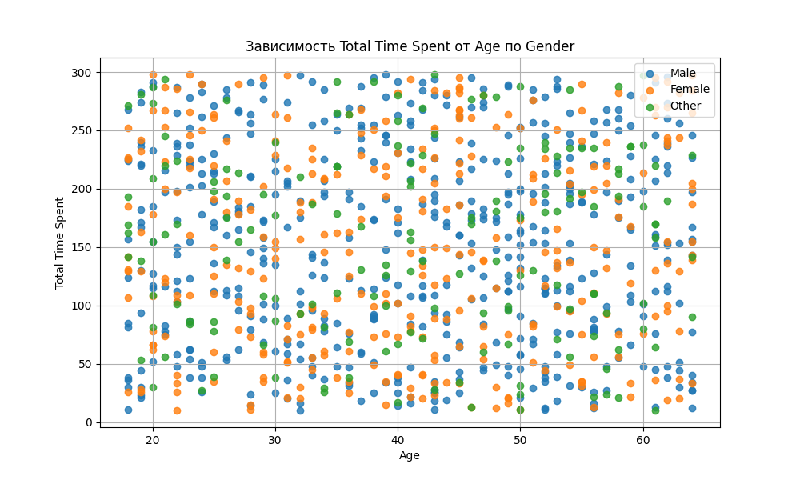

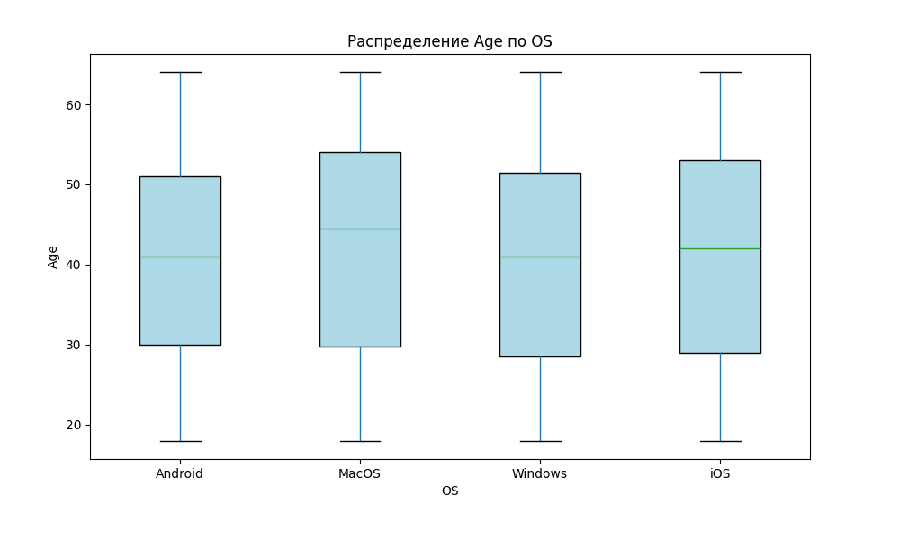

Исходный код:  
```python
import pandas as pd
import matplotlib.pyplot as plt

def scatter_plot(df, show_plots=False):
    fig, ax = plt.subplots(figsize=(10, 6))
    genders = df['Gender'].unique()
    colors = plt.cm.tab10.colors[:len(genders)]

    for i, gender in enumerate(genders):
        subset = df[df['Gender'] == gender]
        ax.scatter(
            subset['Age'],
            subset['Total Time Spent'],
            label=gender,
            color=colors[i],
            alpha=0.8
        )

    ax.set_title('Зависимость Total Time Spent от Age по Gender')
    ax.set_xlabel('Age')
    ax.set_ylabel('Total Time Spent')
    ax.legend()
    ax.grid(True)
    fig.savefig('scatter_plot.png')
    if show_plots:
        plt.show()
    plt.close(fig)

def bar_plot(df, show_plots=False):
    fig, ax = plt.subplots(figsize=(10, 6))
    avg_time_by_demo = df.groupby('Demographics')['Total Time Spent'].mean()
    avg_time_by_demo.plot(kind='bar', ax=ax, color='skyblue')

    for p in ax.patches:
        ax.annotate(f'{p.get_height():.2f}', (p.get_x() + p.get_width() / 2., p.get_height()),
                    ha='center', va='center', xytext=(0, 10), textcoords='offset points')

    ax.set_title('Среднее Total Time Spent по Demographics')
    ax.set_xlabel('Demographics')
    ax.set_ylabel('Среднее Total Time Spent')
    ax.tick_params(axis='x', rotation=45)
    ax.grid(axis='y')
    fig.savefig('bar_plot.png')
    if show_plots:
        plt.show()
    plt.close(fig)

def box_plot(df, show_plots=False):
    fig, ax = plt.subplots(figsize=(10, 6))
    df.boxplot(column='Age', by='OS', ax=ax, grid=False, patch_artist=True, boxprops=dict(facecolor='lightblue'))
    ax.set_title('Распределение Age по OS')
    fig.suptitle('') 
    ax.set_xlabel('OS')
    ax.set_ylabel('Age')
    fig.savefig('box_plot.png')
    if show_plots:
        plt.show()
    plt.close(fig)

def main(show_plots=False):
    file_path = "social_networks.csv"

    try:
        df = pd.read_csv(
            file_path,
            usecols=["UserID", "Age", "Gender", "Demographics", "Total Time Spent", "OS"]
        )
    except ValueError as e:
        raise ValueError(f"Ошибка при чтении CSV: {e}. Проверьте названия столбцов.")

    df['Age'] = pd.to_numeric(df['Age'], errors='coerce')
    df['Total Time Spent'] = pd.to_numeric(df['Total Time Spent'], errors='coerce')
    df = df.dropna()

    print(f"Форма данных: {df.shape}")

    scatter_plot(df, show_plots)
    bar_plot(df, show_plots)
    box_plot(df, show_plots)

if __name__ == "__main__":
    main(show_plots=True)
```

### ***Кейс 8***: Анализ транспортных потоков города
Набор данных: [скачать набор данных](cases/case8/transport_traffic.csv)  

В кейсе анализируется плотность транспортного трафика из файла `transport_traffic.csv`. Строятся три типа графиков:
- **Scatter plot**: Диаграмма рассеяния часов и количества транспорта.
- **Bar plot**: Столбчатая диаграмма среднего количества транспорта по дням недели.
- **Box plot**: Коробчатая диаграмма плотности транспорта по количеству транспорта.

Графики:  
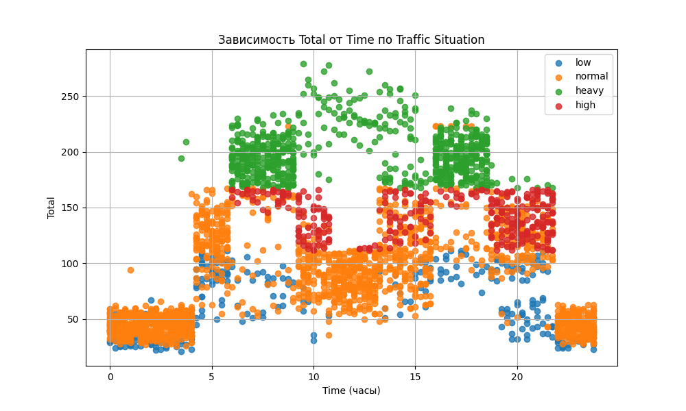
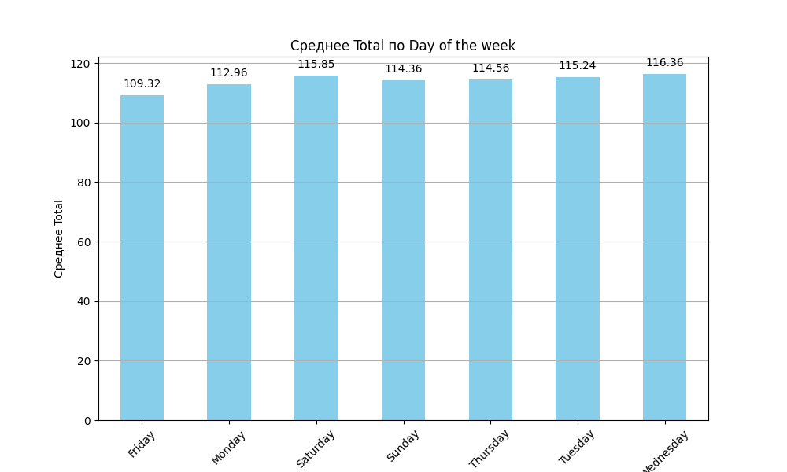
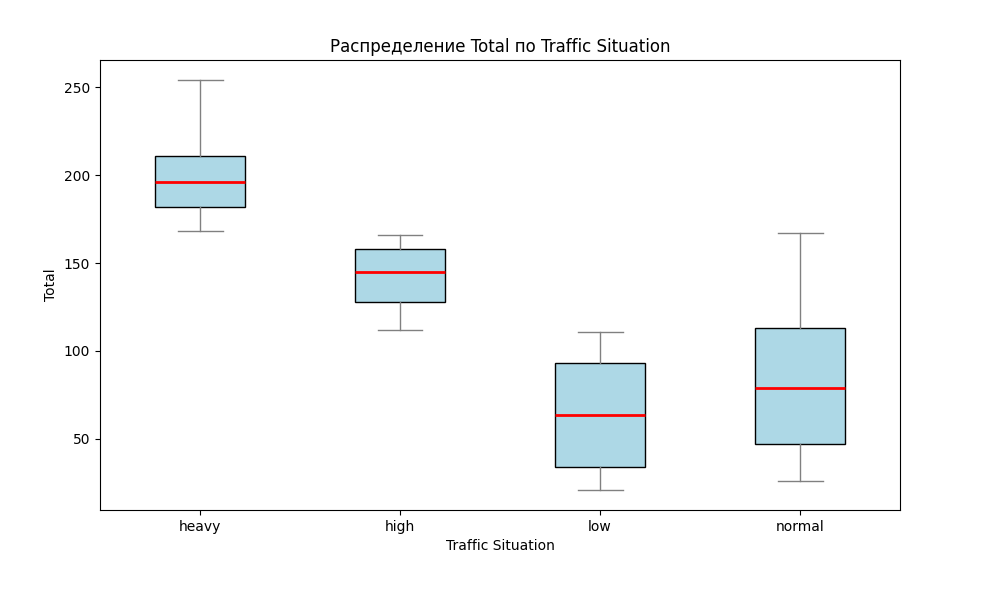

Исходный код:  
```python
import pandas as pd
import matplotlib.pyplot as plt

def scatter_plot(df, show_plots=False):
    fig, ax = plt.subplots(figsize=(10, 6))

    df['Time_Num'] = pd.to_datetime(df['Time'], format='%I:%M:%S %p').dt.hour + pd.to_datetime(df['Time'], format='%I:%M:%S %p').dt.minute / 60.0
    situations = df['Traffic Situation'].unique()
    colors = plt.cm.tab10.colors[:len(situations)]

    for i, situation in enumerate(situations):
        subset = df[df['Traffic Situation'] == situation]
        ax.scatter(
            subset['Time_Num'],
            subset['Total'],
            label=situation,
            color=colors[i],
            alpha=0.8
        )

    ax.set_title('Зависимость Total от Time по Traffic Situation')
    ax.set_xlabel('Time (часы)')
    ax.set_ylabel('Total')
    ax.legend()
    ax.grid(True)
    fig.savefig('scatter_plot.png')
    if show_plots:
        plt.show()
    plt.close(fig)

def bar_plot(df, show_plots=False):
    fig, ax = plt.subplots(figsize=(10, 6))
    avg_total_by_day = df.groupby('Day of the week')['Total'].mean()
    avg_total_by_day.plot(kind='bar', ax=ax, color='skyblue')

    for p in ax.patches:
        ax.annotate(f'{p.get_height():.2f}', (p.get_x() + p.get_width() / 2., p.get_height()),
                    ha='center', va='center', xytext=(0, 10), textcoords='offset points')

    ax.set_title('Среднее Total по Day of the week')
    ax.set_xlabel('Day of the week')
    ax.set_ylabel('Среднее Total')
    ax.tick_params(axis='x', rotation=45)
    ax.grid(axis='y')
    fig.savefig('bar_plot.png')
    if show_plots:
        plt.show()
    plt.close(fig)

def box_plot(df, show_plots=False):
    fig, ax = plt.subplots(figsize=(10, 6))

    box_props = {
        'patch_artist': True,
        'boxprops': dict(facecolor='lightblue'),
        'medianprops': dict(color='red', linewidth=2),
        'whiskerprops': dict(color='gray'),
        'capprops': dict(color='gray')
    }

    df.boxplot(column='Total', by='Traffic Situation', ax=ax, grid=False, showfliers=False, **box_props)
    ax.set_title('Распределение Total по Traffic Situation')
    fig.suptitle('')
    ax.set_xlabel('Traffic Situation')
    ax.set_ylabel('Total')
    fig.savefig('box_plot.png')
    if show_plots:
        plt.show()
    plt.close(fig)

def main(show_plots=False):
    file_path = "transport_traffic.csv"

    try:
        df = pd.read_csv(file_path)
    except ValueError as e:
        raise ValueError(f"Ошибка при чтении CSV: {e}. Проверьте названия столбцов.")

    df['Time'] = pd.to_datetime(df['Time'], format='%I:%M:%S %p', errors='coerce')
    df['Date'] = pd.to_numeric(df['Date'], errors='coerce')
    df['CarCount'] = pd.to_numeric(df['CarCount'], errors='coerce')
    df['BikeCount'] = pd.to_numeric(df['BikeCount'], errors='coerce')
    df['BusCount'] = pd.to_numeric(df['BusCount'], errors='coerce')
    df['TruckCount'] = pd.to_numeric(df['TruckCount'], errors='coerce')
    df['Total'] = pd.to_numeric(df['Total'], errors='coerce')
    df = df.dropna()

    print(f"Форма данных: {df.shape}")

    scatter_plot(df, show_plots)
    bar_plot(df, show_plots)
    box_plot(df, show_plots)

if __name__ == "__main__":
    main(show_plots=True)
```

### ***Кейс 9***: Анализ покупательского поведения
Набор данных: [скачать набор данных](cases/case9/sales_data.csv)  

В кейсе анализируются показатели продаж из файла `sales_data.csv`. Строятся три типа графиков:
- **Scatter plot**: Диаграмма рассеяния размера продаж от времени по регионам.
- **Bar plot**: Столбчатая диаграмма средней величины продаж и поставщиков.
- **Box plot**: Коробчатая диаграмма величины продаж по категориям товаров.

Графики:  


Исходный код:  
```python
import pandas as pd
import matplotlib.pyplot as plt

def scatter_plot(df, show_plots=False):
    fig, ax = plt.subplots(figsize=(10, 6))

    df['Sale_Date_Num'] = (pd.to_datetime(df['Sale_Date']) - pd.to_datetime('2023-01-01')).dt.days

    regions = df['Region'].unique()
    colors = plt.cm.tab10.colors[:len(regions)]

    for i, region in enumerate(regions):
        subset = df[df['Region'] == region]
        ax.scatter(
            subset['Sale_Date_Num'],
            subset['Sales_Amount'],
            label=region,
            color=colors[i],
            alpha=0.6
        )

    ax.set_title('Зависимость Sales_Amount от Sale_Date по Region')
    ax.set_xlabel('Sale_Date (дни с начала 2023)')
    ax.set_ylabel('Sales_Amount')
    ax.legend()
    ax.grid(True)
    fig.savefig('scatter_plot.png')
    if show_plots:
        plt.show()
    plt.close(fig)

def bar_plot(df, show_plots=False):
    fig, ax = plt.subplots(figsize=(10, 6))
    avg_sales_by_rep = df.groupby('Sales_Rep')['Sales_Amount'].mean()
    avg_sales_by_rep.plot(kind='bar', ax=ax, color='skyblue')

    for p in ax.patches:
        ax.annotate(f'{p.get_height():.2f}', (p.get_x() + p.get_width() / 2., p.get_height()),
                    ha='center', va='center', xytext=(0, 10), textcoords='offset points')

    ax.set_title('Среднее Sales_Amount по Sales_Rep')
    ax.set_xlabel('Sales_Rep')
    ax.set_ylabel('Среднее Sales_Amount')
    ax.tick_params(axis='x', rotation=45)
    ax.grid(axis='y')
    fig.savefig('bar_plot.png')
    if show_plots:
        plt.show()
    plt.close(fig)

def box_plot(df, show_plots=False):
    fig, ax = plt.subplots(figsize=(10, 6))

    box_props = {
        'patch_artist': True,
        'boxprops': dict(facecolor='lightblue'),
        'medianprops': dict(color='red', linewidth=2),
        'whiskerprops': dict(color='gray'),
        'capprops': dict(color='gray')
    }

    df.boxplot(
        column='Sales_Amount',
        by='Product_Category',
        ax=ax,
        grid=False,
        showfliers=False,
        **box_props
    )

    ax.set_title('Распределение Sales_Amount по Product_Category')
    fig.suptitle('')  # Убираем автоматический заголовок от pandas
    ax.set_xlabel('Product_Category')
    ax.set_ylabel('Sales_Amount')
    fig.savefig('box_plot.png')
    if show_plots:
        plt.show()
    plt.close(fig)

def main(show_plots=False):
    file_path = "sales_data.csv"

    try:
        df = pd.read_csv(
            file_path,
            usecols=["Product_ID", "Sale_Date", "Sales_Rep", "Region", "Sales_Amount", "Quantity_Sold",
                     "Product_Category", "Unit_Cost", "Unit_Price", "Customer_Type", "Discount", "Payment_Method",
                     "Sales_Channel", "Region_and_Sales_Rep"]
        )
    except ValueError as e:
        raise ValueError(f"Ошибка при чтении CSV: {e}. Проверьте названия столбцов.")

    df['Sale_Date'] = pd.to_datetime(df['Sale_Date'], errors='coerce')
    df['Sales_Amount'] = pd.to_numeric(df['Sales_Amount'], errors='coerce')
    df['Quantity_Sold'] = pd.to_numeric(df['Quantity_Sold'], errors='coerce')
    df['Unit_Cost'] = pd.to_numeric(df['Unit_Cost'], errors='coerce')
    df['Unit_Price'] = pd.to_numeric(df['Unit_Price'], errors='coerce')
    df['Discount'] = pd.to_numeric(df['Discount'], errors='coerce')
    df = df.dropna()

    if df.empty:
        raise ValueError("После очистки данных DataFrame пуст. Проверьте исходный файл.")

    print(f"Форма данных: {df.shape}")

    scatter_plot(df, show_plots)
    bar_plot(df, show_plots)
    box_plot(df, show_plots)

if __name__ == "__main__":
    main(show_plots=True)
```

### ***Кейс 10***: Анализ медицинских данных
Набор данных: [скачать набор данных](cases/case10/enhanced_fever_medicine_recommendation.csv)  

В кейсе анализируются медицинские показатели из файла `enhanced_fever_medicine_recommendation.csv`. Строятся три типа графиков:
- **Scatter plot**: Диаграмма рассеяния температуры тела и возрастов.
- **Bar plot**: Столбчатая диаграмма полов и количества человек.
- **Box plot**: Коробчатая диаграмма тяжести болезни и температуры тела.

Графики:  
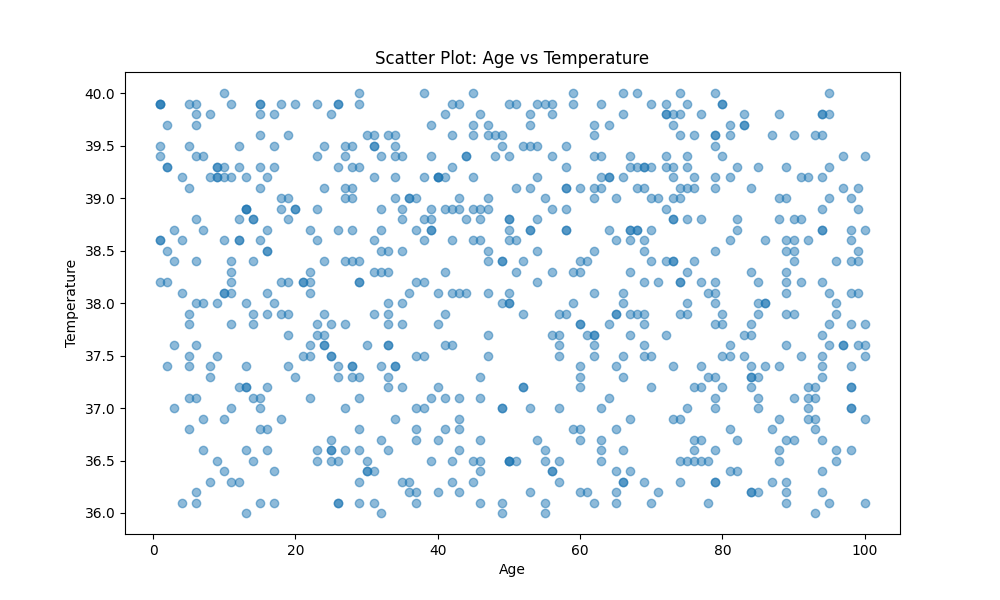
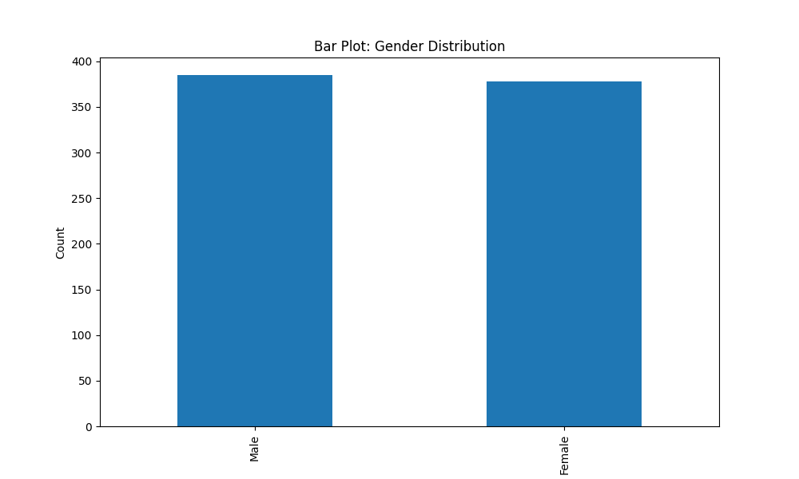
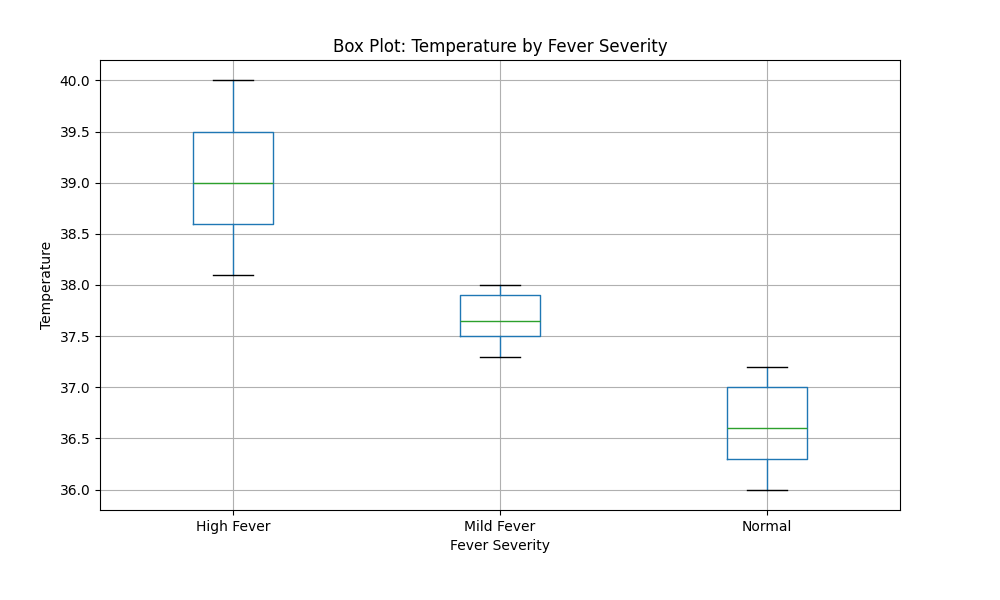

Исходный код:  
```python
import pandas as pd
import matplotlib.pyplot as plt

def scatter_plot(df, show=False):
    fig, ax = plt.subplots(figsize=(10, 6))
    ax.scatter(df['Age'], df['Temperature'], alpha=0.5)
    ax.set_xlabel('Age')
    ax.set_ylabel('Temperature')
    ax.set_title('Age vs Temperature')
    plt.savefig('scatter_plot.png')
    if show:
        plt.show()
    plt.close(fig)

def bar_plot(df, show=False):
    fig, ax = plt.subplots(figsize=(10, 6))
    df['Gender'].value_counts().plot(kind='bar', ax=ax)
    ax.set_xlabel('Gender')
    ax.set_ylabel('Count')
    ax.set_title('Gender Distribution')
    plt.savefig('bar_plot.png')
    if show:
        plt.show()
    plt.close(fig)

def box_plot(df, show=False):
    fig, ax = plt.subplots(figsize=(10, 6))
    df.boxplot(column='Temperature', by='Fever_Severity', ax=ax)
    ax.set_xlabel('Fever Severity')
    ax.set_ylabel('Temperature')
    ax.set_title('Temperature by Fever Severity')
    plt.suptitle('')  # Remove default suptitle
    plt.savefig('box_plot.png')
    if show:
        plt.show()
    plt.close(fig)

def main():
    columns = ("Temperature", "Fever_Severity", "Age", "Gender", "Fatigue",
               "Smoking_History", "Alcohol_Consumption", "Blood_Pressure",
               "Previous_Medication", "Recommended_Medication")

    df = pd.read_csv(filepath_or_buffer="enhanced_fever_medicine_recommendation.csv",
                     usecols=columns)

    df["Temperature"] = pd.to_numeric(df["Temperature"], errors="coerce")
    df["Age"] = pd.to_numeric(df["Age"], errors="coerce")
    df = df.dropna()

    scatter_plot(df, True)
    bar_plot(df, True)
    box_plot(df, True)

if __name__ == "__main__":
    main()
```

### ***Кейс 11***: Анализ финансовых транзакций
Набор данных: [скачать набор данных](cases/case11/bank_transactions_data_2.csv)  

В кейсе анализируются банковские транзакции из файла `bank_transactions_data_2.csv`. Строятся три типа графиков:
- **Scatter plot**: Диаграмма рассеяния возраста покупателей и величины их перевода.
- **Bar plot**: Столбчатая диаграмма типов транзакций и их количества.
- **Box plot**: Коробчатая диаграмма способов перевода и величины перевода.

Графики:  
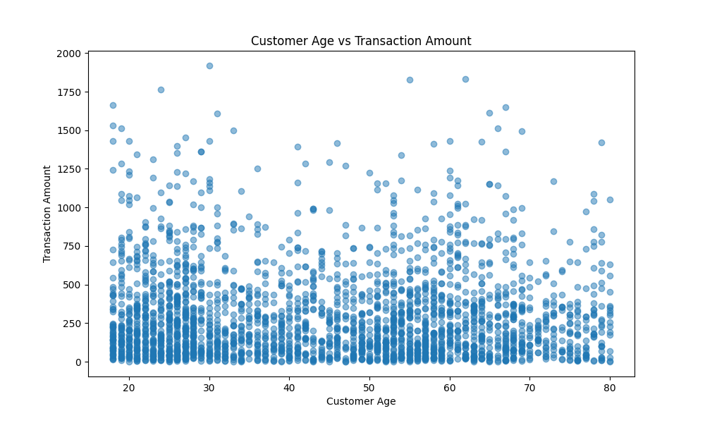
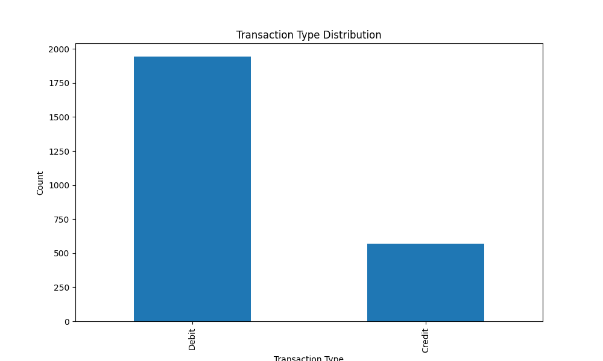
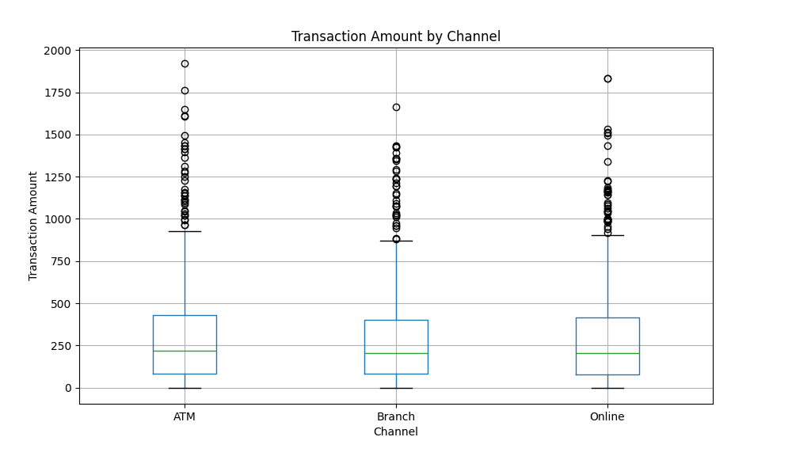

Исходный код:  
```python
import pandas as pd
import matplotlib.pyplot as plt

def scatter_plot(df, show=False):
    fig, ax = plt.subplots(figsize=(10, 6))
    ax.scatter(df['CustomerAge'], df['TransactionAmount'], alpha=0.5)
    ax.set_xlabel('Customer Age')
    ax.set_ylabel('Transaction Amount')
    ax.set_title('Customer Age vs Transaction Amount')
    plt.savefig('scatter_plot.png')
    if show:
        plt.show()
    plt.close(fig)

def bar_plot(df, show=False):
    fig, ax = plt.subplots(figsize=(10, 6))
    df['TransactionType'].value_counts().plot(kind='bar', ax=ax)
    ax.set_xlabel('Transaction Type')
    ax.set_ylabel('Count')
    ax.set_title('Transaction Type Distribution')
    plt.savefig('bar_plot.png')
    if show:
        plt.show()
    plt.close(fig)

def box_plot(df, show=False):
    fig, ax = plt.subplots(figsize=(10, 6))
    df.boxplot(column='TransactionAmount', by='Channel', ax=ax)
    ax.set_xlabel('Channel')
    ax.set_ylabel('Transaction Amount')
    ax.set_title('Transaction Amount by Channel')
    plt.suptitle('')  # Remove default suptitle
    plt.savefig('box_plot.png')
    if show:
        plt.show()
    plt.close(fig)

def main():
    columns = ("TransactionID", "AccountID", "TransactionAmount", "TransactionDate", "TransactionType",
               "Channel", "CustomerAge", "AccountBalance", "PreviousTransactionDate")

    df = pd.read_csv(filepath_or_buffer="bank_transactions_data_2.csv",
                     usecols=columns)

    df["TransactionAmount"] = pd.to_numeric(df["TransactionAmount"], errors="coerce")
    df["TransactionDate"] = pd.to_datetime(df["TransactionDate"], errors="coerce")
    df["CustomerAge"] = pd.to_numeric(df["CustomerAge"], errors="coerce")
    df["AccountBalance"] = pd.to_numeric(df["AccountBalance"], errors="coerce")
    df["PreviousTransactionDate"] = pd.to_datetime(df["PreviousTransactionDate"], errors="coerce")
    df = df.dropna()

    scatter_plot(df, True)
    bar_plot(df, True)
    box_plot(df, True)

if __name__ == "__main__":
    main()
```

### ***Кейс 12***: Анализ данных о погоде
Набор данных: [скачать набор данных](cases/case12/seattle-weather.csv)  

В кейсе анализируются погодные данные из файла `seattle-weather.csv`. Строятся три типа графиков:
- **Scatter plot**: Диаграмма рассеяния максимальной температуры (temp_max) vs минимальной температуры (temp_min).
- **Bar plot**: Столбчатая диаграмма количества записей по месяцам (извлечено из даты).
- **Box plot**: Коробчатая диаграмма максимальной температуры по месяцам.

Графики:  
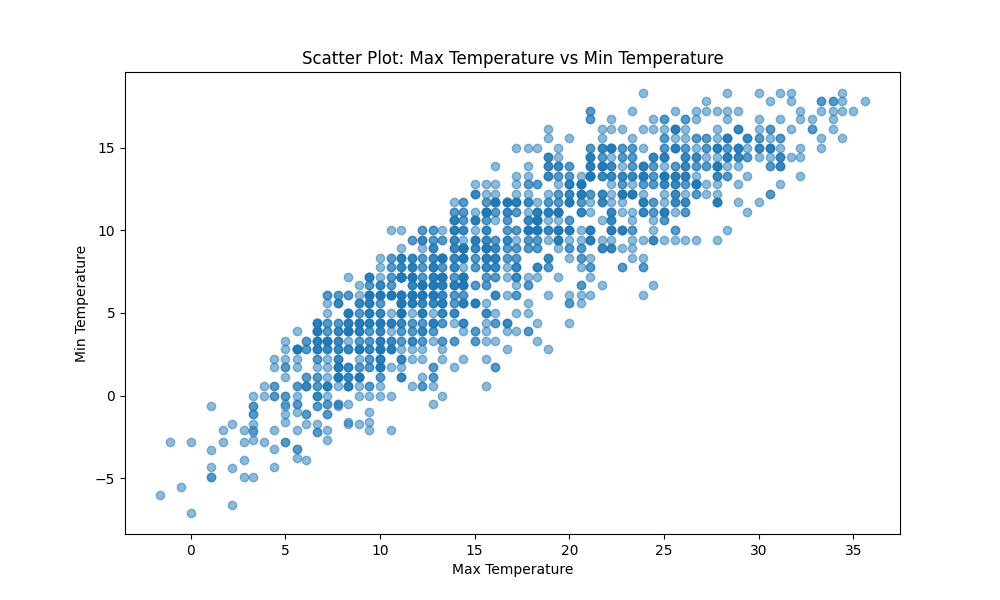
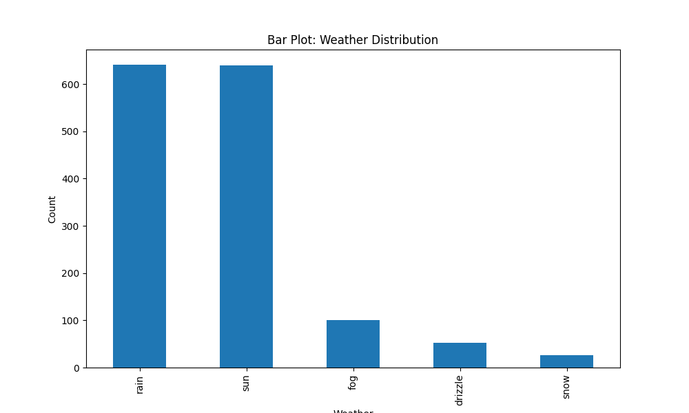
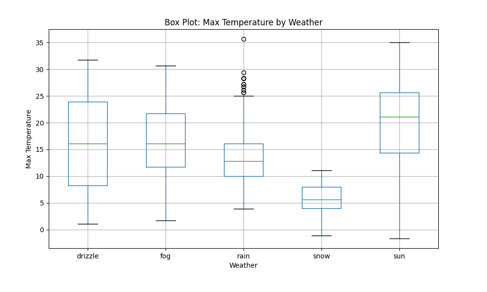

Исходный код:  
```python
import pandas as pd
import matplotlib.pyplot as plt

def scatter_plot(df, show=False):
    fig, ax = plt.subplots(figsize=(10, 6))
    ax.scatter(df['temp_max'], df['temp_min'], alpha=0.5)
    ax.set_xlabel('Max Temperature')
    ax.set_ylabel('Min Temperature')
    ax.set_title('Scatter Plot: Max Temperature vs Min Temperature')
    plt.savefig('scatter_plot.png')
    if show:
        plt.show()
    plt.close(fig)

def bar_plot(df, show=False):
    fig, ax = plt.subplots(figsize=(10, 6))
    df['month'] = df['date'].dt.month
    df['month'].value_counts().sort_index().plot(kind='bar', ax=ax)
    ax.set_xlabel('Month')
    ax.set_ylabel('Count')
    ax.set_title('Bar Plot: Record Count by Month')
    plt.savefig('bar_plot.png')
    if show:
        plt.show()
    plt.close(fig)

def box_plot(df, show=False):
    fig, ax = plt.subplots(figsize=(10, 6))
    df['month'] = df['date'].dt.month
    df.boxplot(column='temp_max', by='month', ax=ax)
    ax.set_xlabel('Month')
    ax.set_ylabel('Max Temperature')
    ax.set_title('Box Plot: Max Temperature by Month')
    plt.suptitle('')  # Убираем стандартный заголовок
    plt.savefig('box_plot.png')
    if show:
        plt.show()
    plt.close(fig)

def main():
    df = pd.read_csv("enhanced_fever_medicine_recommendation.csv")
    
    df["date"] = pd.to_datetime(df["date"], errors="coerce")
    df["precipitation"] = pd.to_numeric(df["precipitation"], errors="coerce")
    df["temp_max"] = pd.to_numeric(df["temp_max"], errors="coerce")
    df["temp_min"] = pd.to_numeric(df["temp_min"], errors="coerce")
    df["wind"] = pd.to_numeric(df["wind"], errors="coerce")
    df = df.dropna()
    
    scatter_plot(df, True)
    bar_plot(df, True)
    box_plot(df, True)

if __name__ == "__main__":
    main()
```
